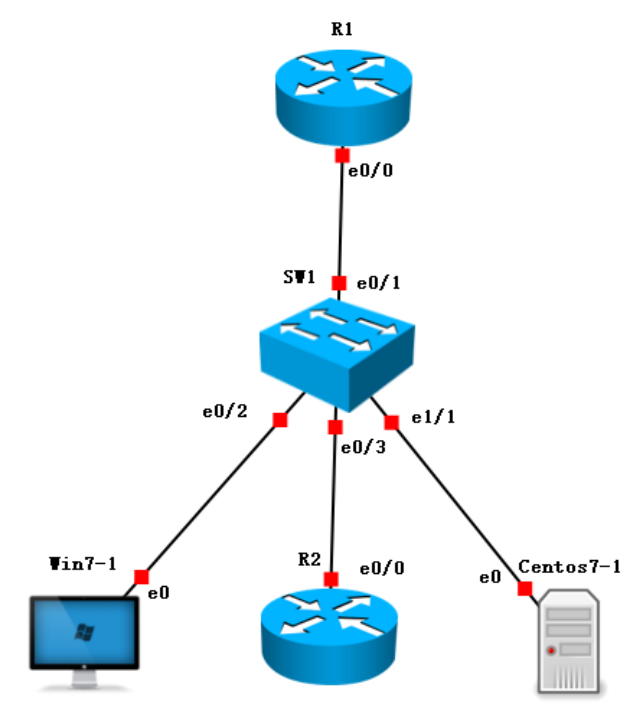
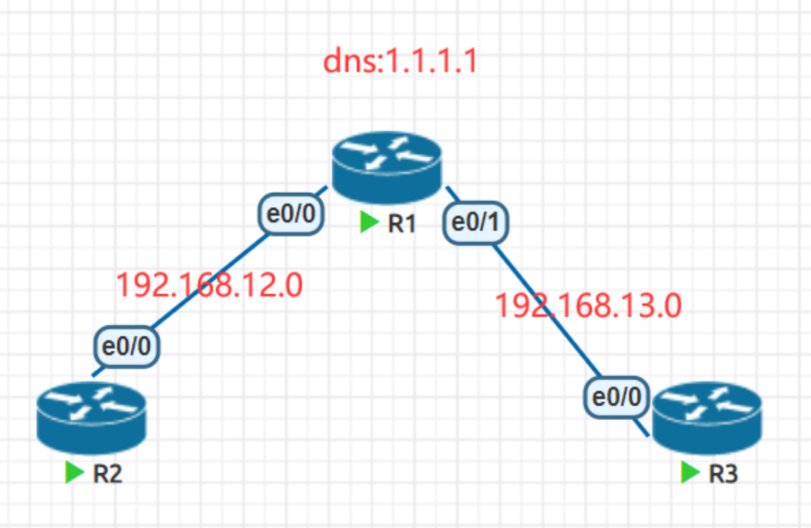
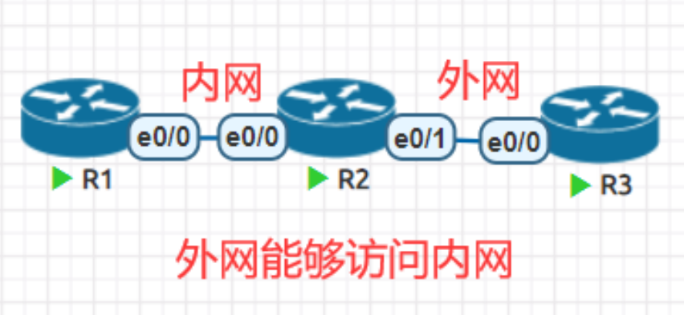
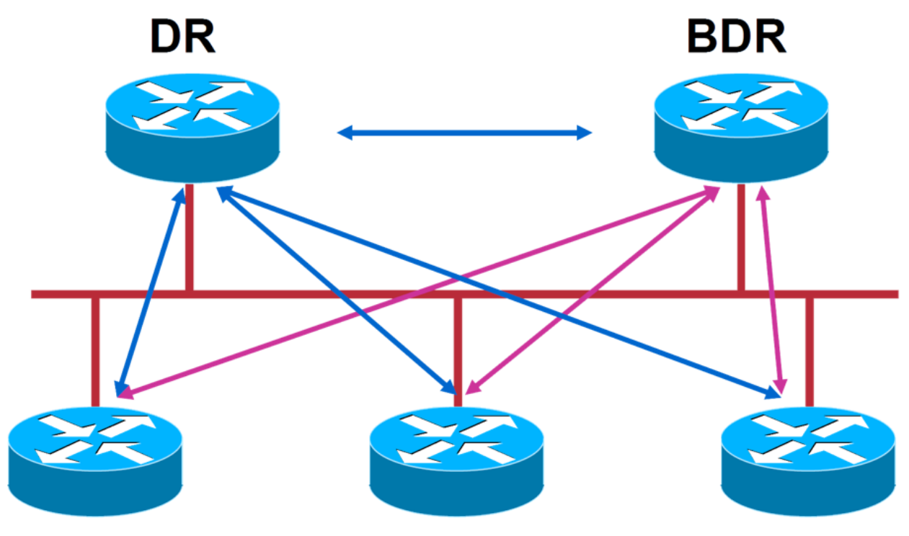
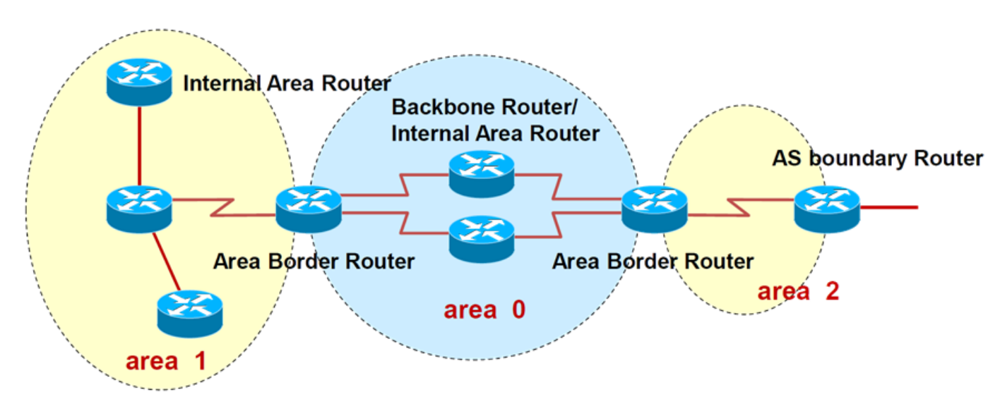
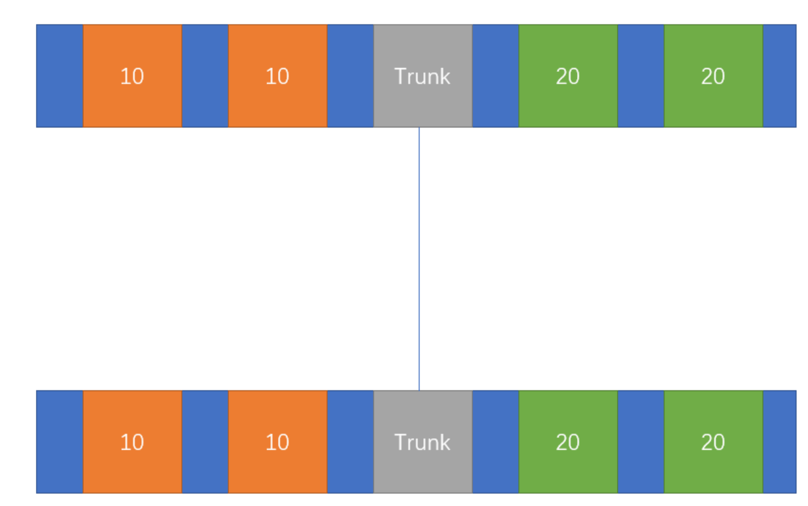
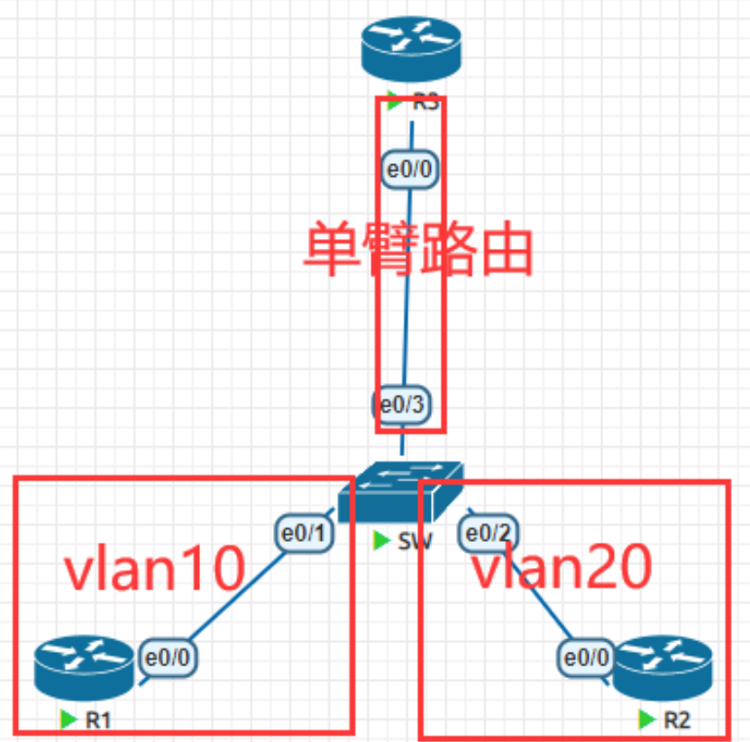
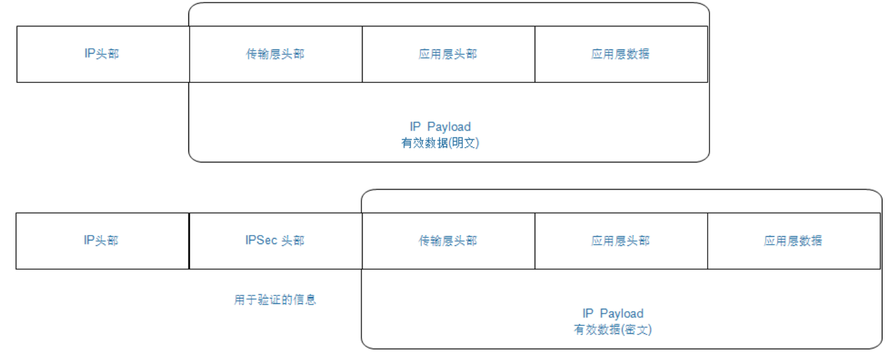

# 静态路由

> 特点
>
> 需要通过手工的方式进行添加及维护；
>
> 适用于组网规模较小的场景，如果网络规模较大，则配置及维护的成本就会很高；
>
> 无法根据拓扑的变化进行动态的响应（各厂商开发了扩展特性，以便弥补静态路由在这点上的不足）；
>
> 在大型的网络中，往往采用动、静态路由结合的方式进行部署。

# 环回接口

> Loopback接口，也叫环回口，是一个逻辑的、虚拟的接口；
>
> Loopback接口常用于：
>
> 模拟路由器的直连网段，可用于测试；
>
> 可用于设备管理（Loopback接口比较稳定）；
>
> 供其他协议使用，例如OSPF、BGP、MPLS等；
>
> SNMPTraps消息的源地址；
>
> 其他用途（Loopback接口的用途十分广泛）。

# 缺省路由

> 缺省路由在路由表中目的地址为0.0.0.0、子网掩码为0.0.0.0
>
> 换言之，如果数据报文的目的地址无法与路由表中的路由记录相匹配，则路由器或网络主机中将使用缺省路由转发该报文。

# DHCP

> 使用UDP协议 工作，主要有两个用途：用于内部网或网络服务供应商自动分配IP地址；

> DHCP使用优点
>
> 减少管理员的工作量
>
> 避免IP冲突
>
> 提高IP地址的利用率
>
> 移动计算机后不用重新配置网络信息，能够方便更改错误的可能性
>
> DHCP用于给设备自动分配IP地址，我们几乎天天用到

> DHCP相关概念
>
> DHCP客户端：获取网络配置参数
>
> DHCP服务端：提供网络配置参数（IP地址，默认网关，租约相关信息等）
>
> DHCP中继代理：服务端和客户端之间转发DHCP的设备（主机或者路由器）
>
> 作用域：一个网络中的所有可分配IP地址的连续范围，主要用来定义物理子网的单一IP地址范围，
>
> 例如192.168.0.0-192.168.255.255
>
> 超级作用域：一组作用域的集合，实现一个物理子网中多个逻辑IP地址。
>
> 排除范围：排除作用域内有限的IP地址序列（不使用DHCP服务）192.168.0.100-192.168.0.200
>
> 地址池：定义作用域+排除范围后，剩余的地址将形成可用地址池
>
> 保留：DHCP服务器提供永久地址租约，确保客户端始终使用相同的IP地址
>
> 租用：客户从服务器上获得并临时占用某IP地址的过程
>
> 租约：获得的IP地址的使用时间。获得IP地址时租约被激活并更新其地址租约；当租约到期或者被删除时租约停止

> DHCP运行过程
>
> ip route 0.0.0.0 0.0.0.0 [IP|INT] # 出接口的地址DHCP客户端在局域网中发起一个DHCPDiscover包，主要用于发现DHCP服务器
>
> DHCP服务端接收到Discover包，回应客端Offer包，用于告诉“我”能提供IP地址
>
> 客户端接收到Offer包后，发送Request请求IP地址
>
> 服务端发送Ack包，确认信息

> DHCP给设备提供的内容如下
>
> IP地址
>
> 子网掩码
>
> 网关地址
>
> DNS服务器地址
>
> 租约时间

# DNS

> 域名解析系统DNS
>
> 一个组织的系统管理机构，维护系统内的每个主机的 IP和主机名 的对应关系
>
> 如果新计算机接入网络，将这个信息注册到 数据库 中
>
> 用户输入域名的时候，会自动查询 DNS 服务器，由 DNS服务器 检索数据库, 得到对应的IP地址。

## 域名

> www.baidu.com
>
> .：根域名
>
> com： 一级域名，表示这是一个企业域名。同级的还有 "net"(网络提供商)，"org"(非盈利组织)
>
> 等。
>
> baidu: 二级域名, 公司名。
>
> www: 只是一种习惯用法，并不是每个域名都支持。
>
> http:// : 要使用什么协议来连接这个主机名。

## 域名解析过程

> 1. 浏览器缓存 
>
> 2. 系统缓存,查找hosts文件 
>
> 3. 路由器缓存(以上三步均为DNS客户端的缓存！！) 
>
> 4. ISP DNS缓存 
>
> 5. 根域名服务器 
>
> 6. 顶级域名服务器 
>
> 7. 主机名服务器 
>
> 8. 保存结果至缓存 
>
> 
>
> DNS查询类型 
>
> 本地解析：过以前查询获得的缓存信息就地应答查询 
>
> 递归查询：DNS服务器代表请求客户机联系其他DNS服务器，以完全解析，返回给客户机 
>
> 迭代查询：客户机自己不断请求DNS服务来解析名称，典型的DNS服务器之间的交互 

## 域名解析记录

> A：记录地址，返回的域名所指向IP地址 
>
> NS：域名服务器，返回保存下一级域名信息的服务器地址。该记录只能设置为域名，不能设置为IP地址 
>
> MX：邮箱记录，返回接收电子邮箱的服务器地址 
>
> CNAME：规范名称记录，返回另一个域名，即当前查询的域名是另一个域名的跳转 
>
> PTR：逆查域名，只用于IP地址查询域名 
>
> dig -x 
>
> dig [a ns mx ] 查询指定的记录类型 
>
> 扩展： 
>
> TXT：用来做SPF（反垃圾邮箱） 
>
> AAAA：用来指定主机名（或域名）对应的IPv6记录。 
>
> SRV：记录哪台计算机提供哪个服务。格式：服务 
>
> 名字、点、协议的类型。 
>
> 显性URL：从一个地址301重定向另一个地址的时候。 隐性URL：类似显性URL、区别在于隐形URL不会改变地址中的域名。

# NAT

> 当今的互联网是由一个个小的自治系统组成，一个家庭，一个企业就是一个小的自治系统
>
> 自治系统内部有着众多的设备需要IP地址联网，每个地址都需要去IANA申请明显做不到，所以就会
>
> 使用私有IP地址进行分配
>
> 私有IP地址无法做到互联网通信，在内网之中就需要一个默认网关来代替大家请求互联网数据
>
> NAT网络地址转换技术能够将数据包中的IP地址进行转换
>
> 可以做负载均衡

# 动态路由协议

> 通过在路由器上运行动态路由协议，使得路由器之间能够交互“用于路由计算的信息”，从而路由器动态的“学习”到网络中的路由

## RIP

> RIP是应用及开发较早的路由协议，是典型的**距离矢量路由协议**
>
> 适用于小型网络，最大跳数15跳（16跳视为不可达）

### 距离矢量路由协议

> 使用距离矢量路由协议的路由器并不了解网络的拓扑。该路由器只知道：
>
> 自身与目的网络之间的距离
>
> 应该往哪个方向或使用哪个接口转发数据包
>
> 路由器收敛完成
>
> 当所有路由表包含相同网络可达性信息
>
> 路由器继续交换路由信息
>
> 当无新路由信息被更新时收敛结束
>
> 网络在达到收敛前无法完全正常工作

## OSPF

> OSPF（Open Shortest Path First，开放最短路径优先）是一种链路状态路由协议，无路由循环（全局拓扑），属于IGP。RFC 2328，“开放”意味着非私有的，对公众开放的。
>
> OSPF的报文封装
>
> OSPF协议包直接封装于IP，协议号89。
>
> OSPF协议使用的组播地址
>
> 所有OSPF路由器——224.0.0.5；DR BDR——224.0.0.6
>
> OSPF路由协议的管理距离：110

### 路由重发步概念

> 是可以将不同的自治系统他们之间的路由信息进行交换
>
> 从一种协议到另外一种协议
>
> 同一种协议的不同实例
>
> 路由重发是针对外部的，自身的路由器不会有变化

### 邻居

> 解决洪范线下 让邻居去通知其子网路由的更新

> DR
>
> DR的作用：多路访问中为了减少邻接关系（N平方的问题）和LSA的洪泛，采用DR机 
>
> 制,BDR提供了备份
>
> MA网络上的所有路由器均与DR、BDR建立邻居关系
>
> BDR
>
> 选举规则
>
> 接口优先级数字越大越优先（优先级为0不能参与DR的选举）
>
> Router ID越大越好
>
> 稳定压倒一切（非抢占）
>
> 通过控制接口优先级是控制DR选举的好办法
>
> DR的选举是基于接口的，如果说某个路由器是DR，这种说法是错误的

### 邻居建立过程

> Down
>
> 路由器未开始运行OSPF
>
> Init
>
> 路由器收到对方发过来的hello，但是却没有发现存在自己的Router-Id
>
> Two-way
>
> 路由器收到对方发过来的hello中，是包含有自己的Router-ID
>
> 表示双方已经正常通信
>
> 如果是广播网络类型，在这个阶段会等待40s种，等所有路由器的Hello都充分交换，然后选
>
> 择Router-id最大的作为DR，过时不候。
>
> Ex-Start
>
> 路由器发送空的DBD数据报文，用来选举由谁来主导整个过程，最终是选择Router-id较大的
>
> L置位表示是否完成选举过程，M置位表示是否是最后一条消息，MS置位表示的是否是
>
> MASTER
>
> Exchange
>
> 路由器交换互相的DBD，可以理解为目录，从的节点率先发送给主节点
>
> 比对哪些LSA是自己没有的
>
> Loading
>
> 向对方发送请求的LSA，接受对方的LSA，可以理解为书的内容
>
> 并且回复ACK
>
> Full
>
> 完成j建立过程

### OSPF消息类型

> hello包
>
> 用来建立以及维护邻居关系的数据包
>
> DBD
>
> 链路状态数据库描述信息
>
> LSR
>
> 链路状态请求，向邻居请求自己没有的信息
>
> LSU
>
> 链路状态更新的信息，可以包含一条或者多条
>
> ACK
>
> 确认消息，表示收到了

### OSPF多区域

#### 单区域问题

> 收到的LSA通告太多了，OSPF路由器的负担很大
>
> 内部动荡会引起全网路由器的完全SPF计算
>
> 资源消耗过多，LSDB庞大，设备性能下降，影响数据转发
>
> 每台路由器都需要维护的路由表越来越大，单区域内路由无法汇总

#### 多区域特点

> 减少了LSA洪泛的范围，有效地把拓扑变化控制在区域内，达到网络优化的目的
>
> 在区域边界可以做路由汇总，减小了路由表
>
> 充分利用OSPF特殊区域的特性，进一步减少LSA泛洪，从而优化路由多区域提高了网络的扩展性，有利于组建大规模的网络

#### 多区域角色

> ABR:
>
> 区域边界路由器，负责各个区域的路由条目传递
>
> 必须至少有一个接口和骨干区域相连
>
> 必须至少有一个接口和非骨干区域相连
>
> ASBR:
>
> AS边界路由器，负责将ospf以外的路由引入

## 六种需要知道的LSA

| 类型 |            解释             |
| :--: | :-------------------------: |
|  1   |          路由器LSA          |
|  2   |           网络LSA           |
|  3   |         网络汇总LSA         |
|  4   |         ASBR汇总LSA         |
|  5   |          AS外部LSA          |
|  6   |          组成员LSA          |
|  7   |         NSSA外部LSA         |
|  8   |         外部属性LSA         |
|  9   | Opaque LSA （链路本地范围） |
|  10  | Opaque LSA （本地区域范围） |
|  11  |    Opaque LSA （AS范围）    |

#### 1类LSA

> 每个路由器针对它所在的区域产生LSA1，描述区域内部与路由器直连的链路的信息（包括链路类型，Cost等） ；
>
> LSA1只允许在本区域内洪泛，不允许跨越ABR；
>
> LSA中会标识路由器是否是ABR(B比特置位),ASBR（E比特置位）或者是Virtual-link（V比特置位）
>
> 的端点的身份信息；

#### 2类LSA

> 描述TransNet（包括Broadcast和NBMA网络）网络信息；
>
> 由DR生成，描述其在该网络上连接的所有路由器以及网段掩码信息，以及这个MA所属的路由器；
>
> LSA类型2只在本区域Area内洪泛，不允许跨越ABR；
>
> Network LSA ID是DR进行宣告的那个接口的IP地址
>
> Network LSA 中没有COST字段

#### 3类LSA

> 由ABR生成，实际上这就就是将区域内部Type1 Type2的信息收集起来以路由子网的形式扩散出去,是Summay LSA中Summay的含义（注意这里的summary与路由汇总没有关系）
>
> Type 3 的链路状态ID是目的网络地址。
>
> 如果—台ABR路由器在与它本身相连的区域内有多条路由可以到达目的地,那么它将只会始发单一的一条网络汇总LSA到骨干区域,而且这条网络汇总LSA是上述多条路由中代价最低的。
>
> ABR收到来自同区域其它ABR传来的Type 3 LSA后重新生成新的Type3 LSA（Advertising Router改为自己）然后继续在整个OSPF系统内扩散

#### 4类LSA

> ASBR Summary LSA由ABR生成，用于描述ABR能够到达的ASBR它的链路状态，链路状态ID为目的ASBR的RID。

#### 5类LSA

> Autonomous System External LSA由ASBR生成用于描述OSPF自治域系统外的目标网段信息，链路状态ID是目的地址的IP网络号。
>
> 外部路由通过重发布，引入OSPF路由域，相应信息(路由条目)由ASBR以LSA5的形式生成然后进入OSPF路由域
>
> OE2 开销= 外部开销；
>
> OE1 开销= 外部开销+ 内部开销；

> 四类LSA告诉你怎么到达ASBR，由ABR产生
>
> 五类LSA告诉你具体外部有哪些路由可以走，由ASBR产生

#### 7类LSA

> NSSA中的外部LSA NSSA External LSA在NSSA(非完全存根区域)not-so-stubby area中ASBR针对外部网络产生类似于LSA5的LSA类型7,链路ID是外部网路地址
>
> LSA类型7只能在NSSA区域中洪泛，到达NSSA区域ABR后，NSSA ABR将其转换成LSA类型5外部路
>
> 由，传播到Area 0，从而传播到整个OSPF路由域
>
> 生成路由缺省用ON2表示，也可指定为ON1；

#### 7类LSA对应的特殊区域stub area

> 随着大量的5类LSA进入ospf区域，OSPF Database会变得庞大，同时路由表的外部地址也会增大。这会占用路由器大量的资源。
>
> 解决这个问题的办法是：让Area内部的路由器不记录任何AS外部的地址，而使用ABR作为默认网关，有一条指向ABR的默认路由。
>
> 这种方式我们把它叫做stub area。
>
> 配置
>
> router ospf 2
>
> area 1 stub
>
> 在区域二里涉及到的所有路由器使用上述命令
>
> 没有配置末梢节点之前的路由表

#### totally stub area

> 有时仅仅不学习外部路由仍然不能够满足需求，路由表和ospf的数据库依然非常庞大，这个时候可以连ospf的其他区域的路由也不学习
>
> 只学习本区域的路由，以及有一条指向ABR的默认路由
>
> 配置与stub不同的是在ABR上配置area 2 stub no-summary
>
> totally stub area的路由表

#### 针对末梢区域的特殊情况NSSA area

> 当我们把区域配置成末梢区域时，有时候有特例想要加入一些外部路由，这个时候nssa允许存在ASBR通过7类LSA的方式将外部路由引入本区域
>
> 不会自动注入默认路由
>
> 不会学习外部路由
>
> 会学习其他区域路由
>
> 可以学习ASBR注入的外部路由
>
> 没有注入默认路由
>
> 配置
>
> 在区域内所有路由器配置以下命令
>
> router ospf 1
>
> area 1 nssa
>
> 配置NSSA之前的路由表

#### Totally NSSA area

> 不会学习外部路由
>
> 不会学习其他区域路由
>
> 可以学习ASBR注入的外部路由
>
> 会自动注入默认路由
>
> 配置：与nssa不同的是在ABR上配置以下命令
>
> router ospf 1
>
> area 1 nssa no-summary

# LAN

> 一般指局域网
>
> 通常会使用到的设备有网卡、集线器、交换机
>
> 一般是指私有网络

# VLAN

> 一个VLAN中所有设备都是在同一个广播域内，不同的VLAN是不同的广播域
>
> VLAN之间相互隔离，广播域不能跨越VLAN传播，不同的VLAN间需要通告三层设备实现互相通信
>
> 一个VLAN一般位一个逻辑子网，由多个VLAN设备
>
> VLAN多基于交换机的接口分配，划分VLAN成员就是对交换机的接口划分
>
> VLAN工作于OSI参考模型第二层
>
> VLAN是二层交换机的一个根本的工作机制

# trunk

> 当一条链路，需要承载多条vlan信息的时候，需要使用trunk来实现
>
> trunk两端采用相同的干道协议
>
> 一般见于交换机之间或者交换机于路由器、服务器之间

# 三层交换

# VPN

> 站点到站点，主要是用于公司重要站点之间的连接
>
> IPsecVPN、MPLSVPN
>
> 远程连接，常用于企业出差人员，在任意一个可以接入互联网的地方，连进企业内部网络
>
> SSLVPN、IPsecVPN、VPDN

## MPLS VPN和IPsecVPN

> MPLS VPN
>
> ​	优点 
>
> ​		作为客户部署简单
>
> ​		带宽和延迟得到保障
>
> ​		跨地域连接也能得到保障稳定性
>
> ​		灵活扩展
>
> ​	缺点
>
> ​		策略需要与运营商协商
>
> ​		费用较为昂贵
>
> IPsec VPN
>
> ​	优点
>
> ​		比较经济
>
> ​		灵活扩展
>
> ​		数据的加密安全
>
> ​	缺点
>
> ​		稳定性依赖于宽带服务商
>
> ​		作为客户需要专业技术人员部署

## GRE

### 轻量级的隧道协议

## IPsec

> 是一项标准的安全技术，它是通过在数据包中插入一个预定义头部的方式来保障网络层数据安全
>
> 私密性
>
> 对数据进行加密
>
> 即使第三方截获数据，第三方也没有能力将其恢复为明文
>
> 完整性
>
> 确保数据传输过程中不会被篡改
>
> 源认证
>
> 确保是合法的源发送的此数据
>
> 接收方能够知道数据发送方是谁

