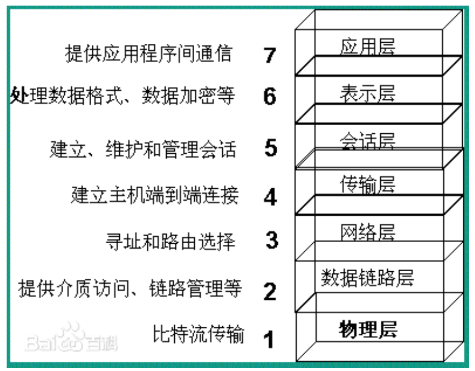
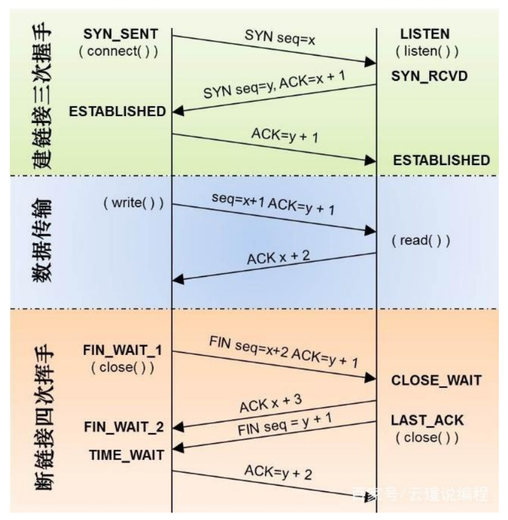
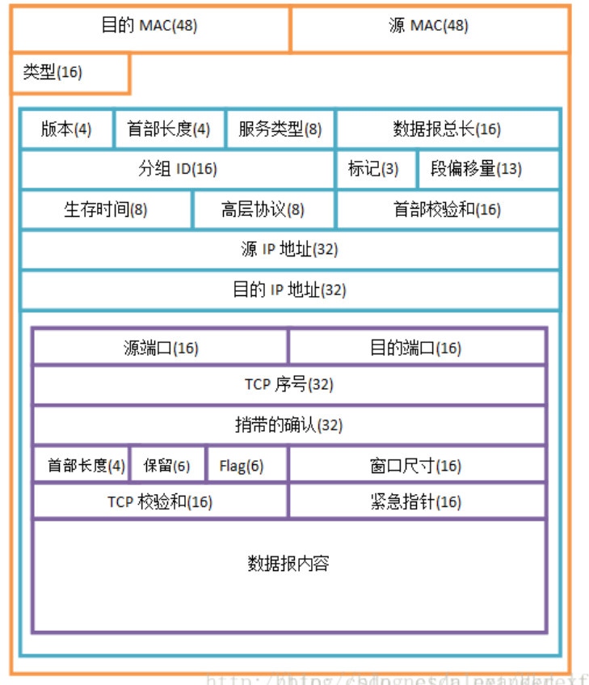

# 网络模型

## 物理层

> 不管通过什么样的介质，将信息的二进制能够传递到另外一个节点，这个过程就是物理层
>
> 归电气工程师管

## 数据链路层

> 封装成帧、差别检错、透明传输
>
> 将物理层传递过来的二进制的信号内容进行翻译，翻译的结果被称为数据帧
>
> 物理层被认为是不可靠的，有可能接触不良，有可能是电测干扰，有可能闪电风暴。。。因此数据链路层通过CRC循环冗余校验生成校验码，放在数据包最后的FCS，用来保证数据正确，如果错误则丢弃。

## 网络层

> 路由，寻址功能
>
> 需要注意的关键内容如下
>
> protocol:UDP、TCP
>
> 源与目的ip地址:mac地址比作为身份证号，那么ip地址就是当前你所处的位置，快递小哥通过你的位置找到你，通过你的身份证确认你

## 传输层

> 端对端的连接
>
> 需要注意的关键内容:源目的端口号(范围是1-65535)

## 会话层

> 会话层使用校验点可使通信会话在通信失效时从校验点继续恢复通信。用于大文件传输。

## 表示层

> 将数据翻译交给应用层显示。例子：浏览器可解析各样的文件，如果不支持gif那么显示失败

## 应用层

> 产生用户数据，为用户提供用户交互的接口

# url和uri

> url是网络中具体的uri 比如https://www.baidu.com是url www.baidu.com是uri

# IP

> 一个ip地址由32位二进制表示。在日常为了方便，分成4组，8位一组。0.0.0.0~255.255.255.255

# 私有IP

> 如果要取得互联网合法地址用于通信，必须要找iana.org组织分配
>
> 很多企业内部都有大量的网络设备，大多数时候这些设备只需要内部通信即可，私有ip不能被外网设备找到。

# 子网掩码

> ip地址是有限的。为了让ip利用率更高，用子网掩码划分网段，处于同一网段的设备才能通信。子网掩码的表示方式和ip一样，二进制位上为1的组成网络号，为0的组成主机号。

# TCP

> tcp全称传输控制协议，传输层用来保障数据的可靠传输，并且携带基本的端口号。可靠的协议，可以知道数据丢失和差错的信息。

> 三次握手：
>
> 第一次握手：客户端告诉服务端我要访问
>
> 第二次握手：服务端告诉客户端 知道你要访问了
>
> 第三次握手：客户端向服务端发送请求        

# UDP

> udp全称用户数据报文协议，只携带了基本的端口号
>
> 尽力而为的协议，无法获知数据的接受情况
>
> 可用于游戏软件上。                                                                                                                                                                                                                                                                                                                                                                                                                                                                                                                                                                                                                                                                                                                                                                                                                                                                                                                                                                                                                                                                                                                                                                                                                        

# 数据报文

# HTTP（瞎写的 后面再改）

1. 寻找浏览器缓存
2. 寻找系统缓存
3. 寻找路由器缓存
4. 以上均为DNS客户端的缓存！！
5. 请求DNS服务器
6. 一步一步去找到ip地址（root->com->baidu->www）
7. 得到ip地址
8. 保存结果至缓存
9. tcp三次握手
10. 发送请求报文
11. 服务器处理
12. 服务器发送响应信息
13. 浏览器解析页面
14. 显示给用户

## 请求报文

> GET /hello.htm HTTP/1.1 
>
> User-Agent: Mozilla/4.0 (compatible; MSIE5.01; Windows NT) 
>
> Host: www.tutorialspoint.com 
>
> Accept-Language: en-us 
>
> Accept-Encoding: gzip, deflate 
>
> Connection: Keep-Alive 

## 请求方法

> GET：请求指定的页面信息
>
> HEAD：类似get请求，但是返回仅仅是头部信息，一个使用场景是在下载一个大文件前
>
> 先获取其大小再决定是否要下载, 以此可以节约带宽资源.
>
> POST：向指定资源提交数据进行处理请求（例如提交表单或者上传文件）
>
> PUT：从客户端向服务器传送的数据取代指定的文档内容
>
> DELETE：请求服务器删除指定的页面
>
> CONNECT： 预留给能够将连接改为管道方式的代理服务器
>
> OPTIONS：允许客户端查看服务器的性能
>
> TRACE： 回显服务器收到的请求，主要用于测试或诊断!
>
> GET方法和POST方法的区别：1.GET提交的数据会放在URL之后，以?分割URL和传输数
>
> 据，参数之间以&相连，如 EditPosts.aspx? name=test1&id=123456 . POST方法是
>
> 把提交的数据放在HTTP包的Body中。 2.GET提交的数据大小有限制（因为浏览器对URL
>
> 的长度有限制），而POST方法提交的数据没有限制。 3.GET方式需要使用
>
> Request.QueryString 来取得变量的值，而POST方式通过 Request.Form 来获取变量
>
> 的值。 4.GET方式提交数据，会带来安全问题，比如一个登录页面，通过GET方式提交
>
> 数据时，用户名和密码将出现在URL 上，如果页面可以被缓存或者其他人可以访问这台
>
> 机器，就可以从历史记录获得该用户的账号和密码。

## 响应报文

> HTTP/1.1 200 OK 
>
> Date: Mon, 27 Jul 2009 12:28:53 GMT 
>
> Server: Apache/2.2.14 (Win32) 
>
> Last-Modified: Wed, 22 Jul 2009 19:15:56 GMT 
>
> Content-Length: 88 
>
> Content-Type: text/html 
>
> Connection: Closed 

## 协议版本

> 常见版本HTTP1.1

## 状态码

> 1xx：指示信息——表示请求已经接收，继续处理
>
> 2xx：成功——表示请求已经被成功接收、理解、接收
>
> 3xx：重定向——要完成请求必须进行更进一步的操作
>
> 4xx：客户端错误——请求的语法有错误或请求无法实现
>
> 5xx：服务端错误——服务器未能实现合法的请求!
>
> 200：OK请求已经正常处理完毕
>
> 301：请求永久重定向
>
> 302：请求临时重定向
>
> 304：请求被重定向到客户端本地缓存
>
> 400：客户端请求存在语法错误
>
> 401：客户端请求没有经过授权
>
> 403：客户端的请求被服务器拒绝，一般为客户端没有访问权限
>
> 404：客户端请求的URL在服务端不存在
>
> 500：服务端永久错误
>
> 503：服务端发生临时错误

