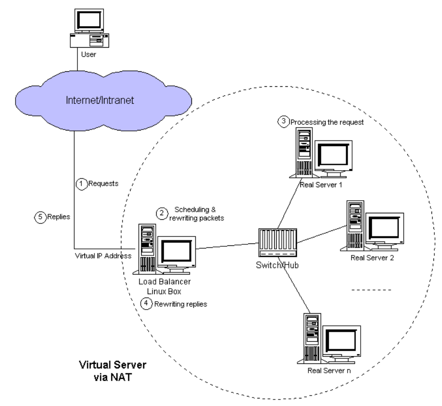
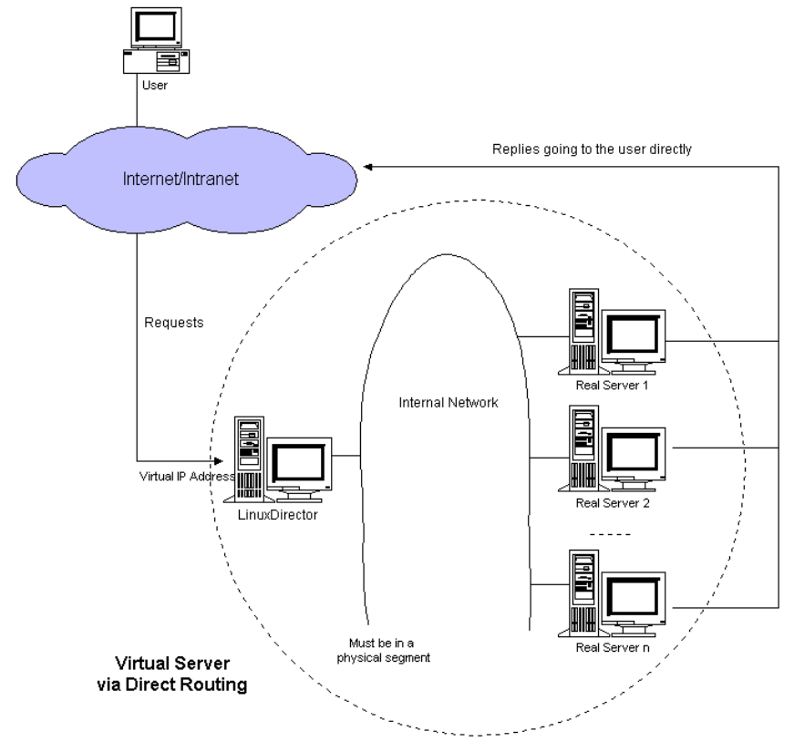
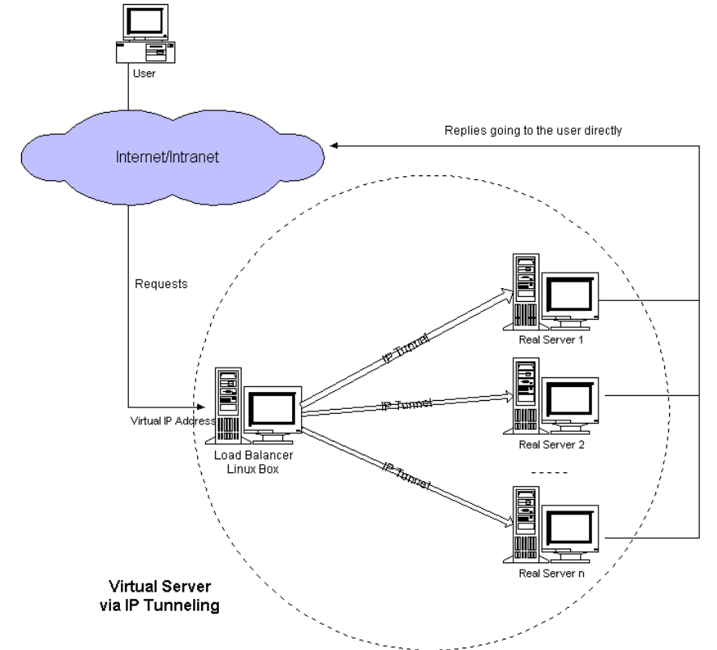

# 四层负载均衡和七层负载均衡

## 四层负载均衡

> 所谓四层负载均衡，也就是主要通过报文中的目标地址和端口，再加上负载均衡设备设置的服务器选择方式，决定最终选择的内部服务器。
>
> TCP的连接建立，即三次握手是客户端和服务器直接建立的，负载均衡设备只是起到一个类似路由器的转发动作。在某些部署情况下，为保证服务器回包可以正确返回给负载均衡设备，在转发报文的同时可能还会对报文原来的源地址进行修改。

## 七层负载均衡

> 所谓七层负载均衡，也称为“内容交换”，也就是主要通过报文中的真正有意义的应用层内容，再加上负载均衡设备设置的服务器选择方式，决定最终选择的内部服务器。
>
> 以常见的TCP为例，负载均衡设备如果要根据真正的应用层内容再选择服务器，只能先代理最终的服务器和客户端建立连接(三次握手)后，才可能接受到客户端发送的真正应用层内容的报文，然后再根据该报文中的特定字段，再加上负载均衡设备设置的服务器选择方式，决定最终选择的内部服务器。

## 区别

> 四层负载均衡效率更高
>
> 七层负载均衡更智能
>
> 根据需求决定负载均衡

# nginx负载均衡

## 四层

> 实验

```bash
[root@node1 ~]# cat /etc/nginx/nginx.conf
user nginx;
worker_processes auto;
error_log /var/log/nginx/error.log;
pid /run/nginx.pid;
include /usr/share/nginx/modules/*.conf;
events { 
	worker_connections 1024; 
}
stream {
	upstream sshsers{ 
		server 192.168.10.20:22;
		server 192.168.10.30:22;
		least_conn;
	}
	server{ 
		listen 172.16.0.10:22222;
		proxy_pass sshsers;
	}
}
```

## 七层

> 实验

```bash
[root@node1 ~]# cat /etc/nginx/conf.d/proxy.conf 
upstream websers{ 
	server 192.168.10.20;
	server 192.168.10.30;
}
server{
	listen 8080;
	server_name 172.16.0.10:8080;
	location / {
		proxy_pass http://websers;
	}
}
```

# HAproxy

> HAProxy（高性能-代理）目前是一款使用广泛的软负载均衡器，它可以实现TCP/HTTP的负载均衡。
>
> 特性：
>
> 免费开源
>
> 最大并发量能达到5w
>
> 支持多种负载均衡算法，同时支持session保持
>
> 支持虚拟主机
>
> 拥有服务监控页面，可以了解系统的实时运行状态
>
> 通常不做正向代理，有更好的选择（Squid）
>
> 通常不做缓存代理，有更好的选择（Varnish）
>
> 不会改变请求和响应报文
>
> 不用于Web服务器
>
> 不是基于数据包的负载均衡器，看不到ip数据包

## 全局配置

> log 定义全局的syslog服务器 
>
> chroot 定义工作目录 
>
> pidfile 指定PID 
>
> maxconn 定义最大并发数 
>
> user 用户名 
>
> group 组名 
>
> daemon 以守护进程方式工作于后台

```bash
global
    log         127.0.0.1 local2

    chroot      /var/lib/haproxy
    pidfile     /var/run/haproxy.pid
    maxconn     4000
    user        haproxy
    group       haproxy
    daemon

    stats socket /var/lib/haproxy/stats
```


## 默认配置

> mode 运行模式或协议 
>
> log 定义每个实例启用事件和流量日志 
>
> maxconn 定义最大并发数 

```bash
defaults
    mode                    http
    log                     global
    option                  httplog
    option                  dontlognull
    option http-server-close
    option forwardfor       except 127.0.0.0/8
    option                  redispatch
    retries                 3
    timeout http-request    10s
    timeout queue           1m
    timeout connect         10s
    timeout client          1m
    timeout server          1m
    timeout http-keep-alive 10s
    timeout check           10s
    maxconn                 3000
```


## 监听配置

```bash
frontend  main *:5000
	# 测试请求的URL是否以指定的模式开头
    acl url_static       path_beg       -i /static /images /javascript /stylesheets
    # 测试请求的URL是否以<string>指定的模式结尾
    acl url_static       path_end       -i .jpg .gif .png .css .js
	
    use_backend static          if url_static
    # 指定后端的名称（当use_backend 没能匹配）
    default_backend             app
```


## 转发的目的地配置

```bash
backend static
    balance     roundrobin
    server      static 127.0.0.1:4331 check

backend app
    balance     roundrobin
    server  app1 127.0.0.1:5001 check
    server  app2 127.0.0.1:5002 check
    server  app3 127.0.0.1:5003 check
    server  app4 127.0.0.1:5004 check
```


# LVS

## NAT

> 特点
>
> RS应该使用私有地址，网关为DIP
>
> DIP和RIP属于同一个网段
>
> 请求和响应报文都需要经过DS（性能瓶颈）
>
> 支持端口映射
>
> RS可以使用任意操作系统



## DR

> 特点
>
> 保证前端路由将目标地址为VIP报文统统发给Director Server
>
> RS可以使用私有地址；也可以是公网地址，如果使用公网地址，此时可以通过互联网对RIP进
>
> 行直接访问
>
> RS跟Director Server必须在同一个物理网络中
>
> 所有的请求报文经由Director Server，但响应报文必须不能经过Director Server
>
> 不支持地址转换，也不支持端口映射
>
> RS的网关绝不允许指向DIP(因为我们不允许他经过director)
>
> RS上的lo接口配置VIP的IP地址



## TUN

> 通过包一层数据用来装vip从而取代了用lo去表达vip

> 特点
>
> RIP、VIP、DIP全是公网地址
>
> RS的网关不会也不可能指向DIP
>
> 所有的请求报文经由Director Server，但响应报文必须不能进过Director Server
>
> 不支持端口映射 RS的系统必须支持隧道



## 部署NAT

> 部署DS

```bash
1.安装ipvsadm工具 
[root@node1 ~]# yum install ipvsadm -y 
2.打开转发，配置nat [root@node1 ~]# echo 1 >> /proc/sys/net/ipv4/ip_forward 
[root@node1 ~]# iptables -t nat -F 
[root@node1 ~]# iptables -t nat -A POSTROUTING -s 192.168.10.0/24 -o ens37 - j MASQUERADE 
3.设置wrr策略和添加RS主机 
[root@node1 ~]# ipvsadm -A -t 172.16.0.10:80 -s wrr 
[root@node1 ~]# ipvsadm -a -t 172.16.0.10:80 -r 192.168.10.20:80 -m -w 1 
[root@node1 ~]# ipvsadm -a -t 172.16.0.10:80 -r 192.168.10.30:80 -m -w 1 
4.查看策略信息 
[root@node1 ~]# ipvsadm -ln
IP Virtual Server version 1.2.1 (size=4096) 
Prot LocalAddress:Port Scheduler Flags
-> RemoteAddress:Port Forward Weight ActiveConn InActConn 
TCP 172.16.0.10:80 wrr 
-> 192.168.10.20:80 Masq 1 0 0 
-> 192.168.10.30:80 Masq 1 0 0
```


> 部署RS

```bash
# RS的网关必须指向DS 
[root@node2 ~]# echo "RS2" > /usr/share/nginx/html/index.html 
[root@node3 ~]# echo "RS3" > /usr/share/nginx/html/index.html 
[root@node1 ~]# curl 172.16.0.10 RS1 
[root@node1 ~]# curl 172.16.0.10 RS2 
注意：selinux策略和防火墙！
```


## 部署DR

> 部署DS

```bash
[root@node1 ~]# ifconfig ens33:0 192.168.80.100 broadcast 192.168.80.255 netmask 255.255.255.0 up 
[root@node1 ~]# route add -host 192.168.80.100 dev ens33:0 
[root@node1 ~]# ipvsadm -A -t 192.168.80.100:80 -s wrr 
[root@node1 ~]# ipvsadm -a -t 192.168.80.100:80 -r 192.168.80.20:80 -g -w 2 
[root@node1 ~]# ipvsadm -a -t 192.168.80.100:80 -r 192.168.10.30:80 -g -w 1
```

> 部署RS

```bash
[root@node2 ~]# cat rs.sh 
#!/bin/bash 
vip=192.168.80.100 
ifconfig lo:0 $vip broadcast 192.168.80.255 netmask 255.255.255.255 up 
route add -host $vip lo:0 
echo "1" >/proc/sys/net/ipv4/conf/lo/arp_ignore 
echo "2" >/proc/sys/net/ipv4/conf/lo/arp_announce 
echo "1" >/proc/sys/net/ipv4/conf/all/arp_ignore 
echo "2" >/proc/sys/net/ipv4/conf/all/arp_announce 

在所有RS上部署！
```


# keepalived

> Keepalived是Linux下一个轻量级别的高可用解决方案，Keepalived起初是为LVS设计的，专门用
>
> 来监控集群系统 中各个服务节点的状态，如果某个服务器节点出现故障，Keepalived将检测到后
>
> 自动将节点从集群系统中剔除。
>
> 后来Keepalived又加入了VRRP的功能，VRRP（VritrualRouterRedundancyProtocol,虚拟路由冗
>
> 余协议)出现的目 的是解决静态路由出现的单点故障问题，通过VRRP可以实现网络不间断稳定运
>
> 行，因此Keepalvied一方面具有服 务器状态检测和故障隔离功能，另外一方面也有HAcluster功
>
> 能。
>
> 健康检查和失败切换是keepalived的两大核心功能。所谓的健康检查，就是采用tcp三次握手，
>
> icmp请求，http请 求，udp echo请求等方式对负载均衡器后面的实际的服务器(通常是承载真实业
>
> 务的服务器)进行保活；而失败切换 主要是应用于配置了主备模式的负载均衡器，利用VRRP维持主
>
> 备负载均衡器的心跳，当主负载均衡器出现问题时， 由备负载均衡器承载对应的业务，从而在最大
>
> 限度上减少流量损失，并提供服务的稳定性。
>
> 工作原理
>
> 网络层：通过ICMP协议向后端服务器集群中发送数据报文
>
> 传输层：利用TCP协议的端口连接和扫描技术检测后端服务器集群是否正常
>
> 应用层：自定义keepalived工作方式（脚本）

## VRRP协议

> VRRP协议是一种容错的主备模式的协议，保证当主机的下一跳路由出现故障时，由另一台路由器
>
> 来代替出现故障的 路由器进行工作，通过VRRP可以在网络发生故障时透明的进行设备切换而不影
>
> 响主机之间的数据通信。
>
> 虚拟路由器：VRRP组中所有的路由器，拥有虚拟的IP+MAC(00-00-5e-00-01-VRID)地址主路由器：虚拟路由器内部通常只有一台物理路由器对外提供服务，主路由器是由选举算法产生，
>
> 对外提供各种网 络功能。
>
> 备份路由器：VRRP组中除主路由器之外的所有路由器，不对外提供任何服务，只接受主路由的通
>
> 告，当主路由器挂 掉之后，重新进行选举算法接替master路由器。
>
> 选举机制
>
> 优先级
>
> 抢占模式下，一旦有优先级高的路由器加入，即成为Master
>
> 非抢占模式下，只要Master不挂掉，优先级高的路由器只能等待
>
> 三种状态
>
> Initialize状态：系统启动后进入initialize状态
>
> Master状态
>
> Backup状态

## 在需要高可用的服务器上部署

```bash
#!/bin/bash 

yum install keepalived -y 
mv /etc/keepalived/keepalived.conf{,.bak} 
cat > /etc/keepalived/keepalived.conf << EOF 
! Configuration File for keepalived 
global_defs { 
	router_id node1 # 需要id不一样
}
vrrp_instance VI_1 { 
	state MASTER # 备份节点为BACKUP
	interface ens33
	virtual_router_id 10
	priority 100 # 备份节点小于100
	advert_int 1
	authentication {
		auth_type PASS
		auth_pass 1111 
	}
	virtual_ipaddress { 
		192.168.10.100 
	} 
}
# 定义script 
vrrp_script chk_http_port { 
	script "/usr/local/src/check_nginx_pid.sh" 
	interval 1 
	weight -2 # 优先级-2 
}

[root@node1 ~]# cat /usr/local/src/check_nginx_pid.sh 
#!/bin/bash 
# 当nginx正常的时候状态码为0 
# 当nginx不正常时候状态码为1 
# 因为当退出状态码为非0的时候会执行切换 
nginx_process_number=`ps -C nginx --no-header | wc -l` 
if [ $nginx_process_number -eq 0 ];then 
	# systemctl restart nginx 
	nginx_process_number=`ps -C nginx --no-header | wc -l` 
	if [ $nginx_process_number -eq 0 ];then 
		exit 1 
	else
		exit 0
	fi 
else
	exit 0 
fi
```

